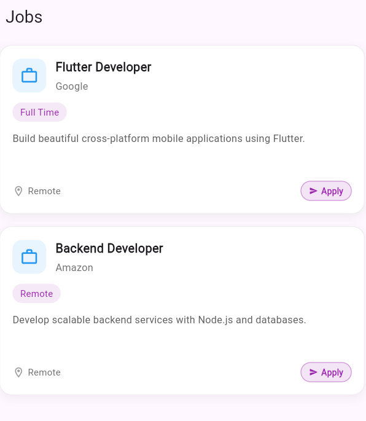

# Job Card Component

A modern and reusable Flutter Job Card UI component for displaying job opportunities in mobile applications.

---

## Features

- Clean modern UI
- Reusable component architecture
- Responsive layout
- Apply button interaction
- Applied status badge
- Company and job information display
- Customizable design

---

## Preview

<!-- Add screenshots here -->



# Installation

Clone the repository:

```bash
git clone https://github.com/your-username/job-card-component.git
```

Go to the project directory:

```bash
cd job-card-component
```

Install dependencies:

```bash
flutter pub get
```

Run the app:

```bash
flutter run
```

---

# Project Structure

```text
lib/
│
├── components/
│   └── job_card.dart
│
├── models/
│   └── job_model.dart
│
├── mockData/
│   └── jobs_data.dart
│
└── main.dart
```

---

# Usage

Import the component:

```dart
import 'components/job_card.dart';
```

Create a job object:

```dart
final job = JobDetails(
  title: 'Flutter Developer',
  companyName: 'Google',
  description:
      'Build beautiful cross-platform mobile applications using Flutter.',
  extensions: ['Full Time'],
);
```

Use the component:

```dart
JobCard(
  job: job,
  isApplied: false,
  onApply: () {
    debugPrint("Applied");
  },
)
```

---

# Job Model

```dart
class JobDetails {
  final String title;
  final String companyName;
  final String description;
  final List<String> extensions;

  JobDetails({
    required this.title,
    required this.companyName,
    required this.description,
    required this.extensions,
  });
}
```

---

# Technologies Used

- Flutter
- Dart

---

# Customization

You can easily customize:

- Colors
- Icons
- Fonts
- Border radius
- Shadows
- Button styles
- Layout spacing
- Job status indicators

---
